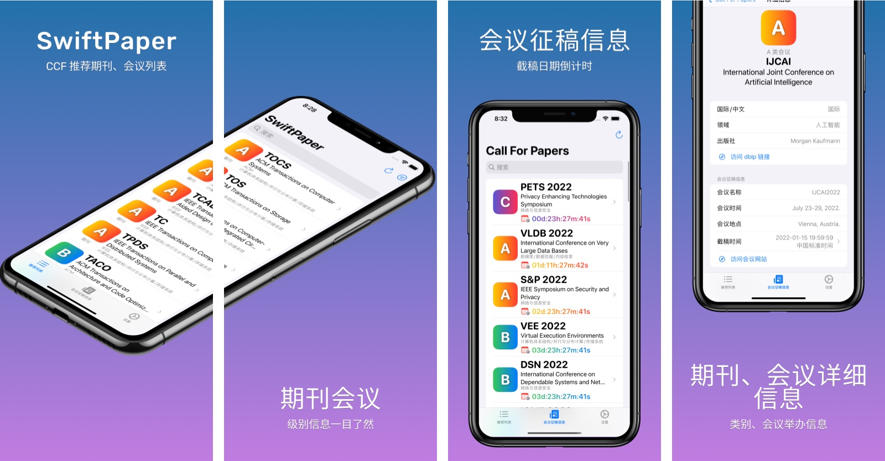
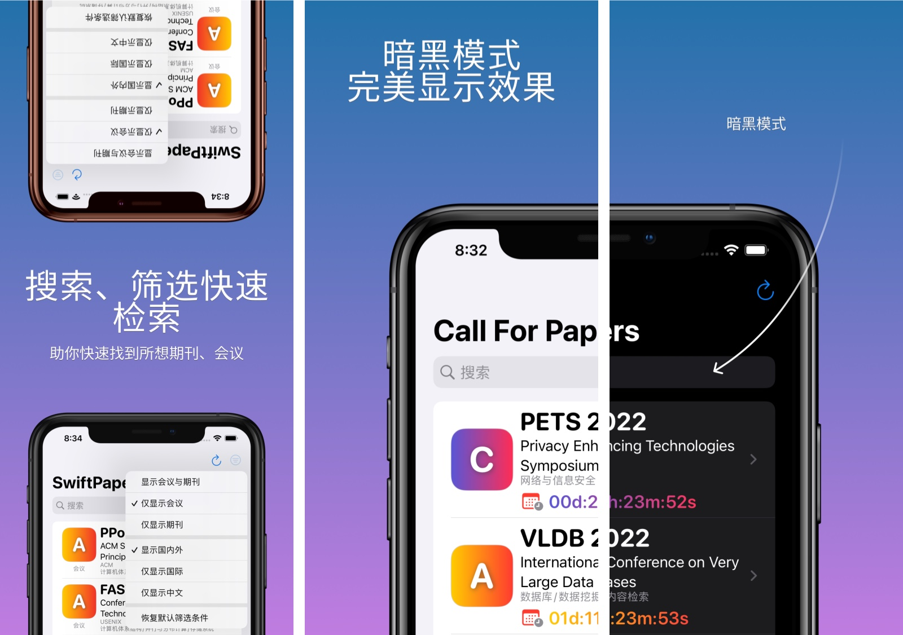

# SwiftPaper

**SwiftPaper** 能够快速地查询 CCF 计算机推荐期刊、会议列表，包含查询该会议、期刊的详细信息，访问会议、期刊的网址以及会议征稿信息等功能。

期刊、会议的简称、全称是什么？领域是什么？出版社是哪一家？dblp网址是什么？在这里您都可以查到。

会议什么时候截稿？会议举办地是哪里？增加全新查看会议征稿信息功能！截稿倒计时告诉您还有多久截稿！

## App Store

## Screenshots

##  Acknowledgments

- [中国计算机学会推荐国际学术会议和期刊目录](https://www.ccf.org.cn/c/2019-04-25/663625.shtml)
- [中国计算机学会推荐中文科技期刊目录](https://www.ccf.org.cn/c/2019-07-31/667609.shtml)
- [ccf-deadlines](https://github.com/ccfddl/ccf-deadlines)
